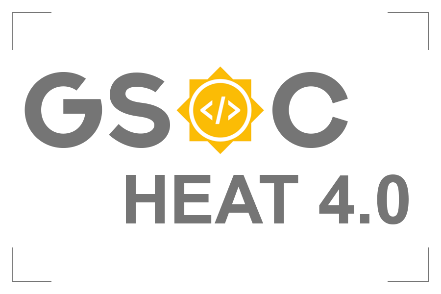

# Codeara
An Online Code Execution Platform using API



[](https://forthebadge.com)
<br>
[](https://gitter.im/NIT-dgp/General?utm_source=badge&utm_medium=badge&utm_campaign=pr-badge&utm_content=badge)

[](https://nitdgpos.github.io/gsoc_heat)
<br>
[](https://forthebadge.com)
[](https://forthebadge.com)
[](https://forthebadge.com)
[](https://forthebadge.com)


> This app is used to compile and execute the program with login feature. It also has sample problems and 
user's progress record.

##  Starting the Project 

* `mkdir CodeCompiler`

* `cd CodeCompiler`

* Creating a virtualenv with python and activate it
```
sudo apt install python3-venv

python3 -m venv <environment name>

source <environment name>/bin/activate
```

* `git clone https://github.com/lugnitdgp/Codeara.git`

* `cd Codeara`

* `sudo apt-get install python3-dev default-libmysqlclient-dev build-essential`

* `pip3 install -r requirements.txt`

* Run the Migrations
```
python3 manage.py makemigrations

python3 manage.py migrate

``` 
* Run the development server 
```
python3 manage.py runserver

```
* Head to server http://localhost:8000

* Add Few Questions in Question model to display random questions

## For Contribution

Read the <a href="CONTRIBUTING.md">CONTRIBUTING.md</a> to know how to contribute
1. Find an issue to resolve.
2. Comment on the issue.
3. Fork the repository
4. Make changes and push.
5. Make a pull request and wait for merging.


